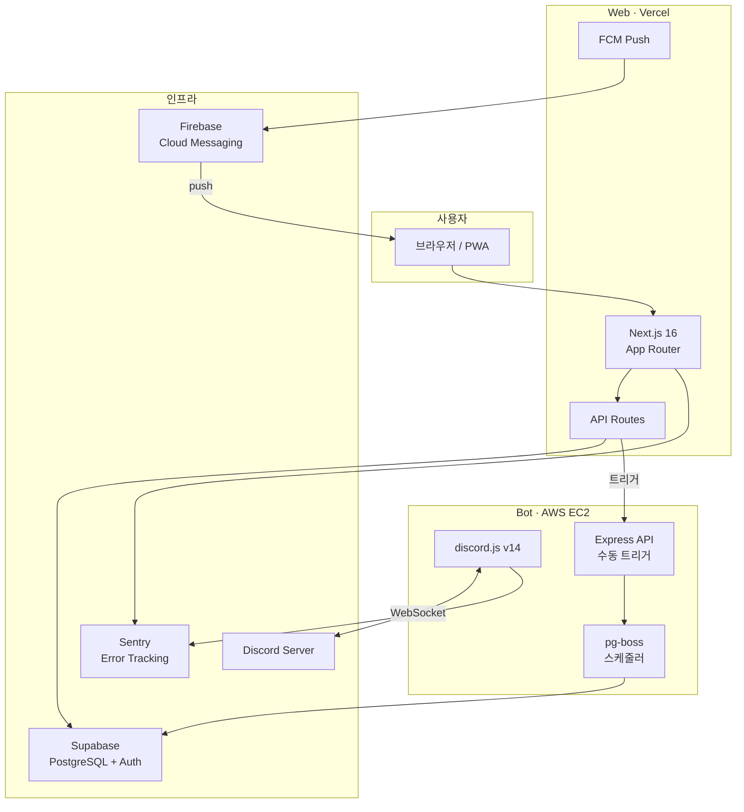

# 큐스팅 4th · 블로그 글쓰기 스터디

2주에 한 편, 블로그 글을 쓰며 함께 성장하는 스터디 플랫폼.
웹 대시보드 + Discord 봇으로 스터디 운영을 자동화합니다.

## 아키텍처



## 기술 스택

| 영역 | 기술 |
|------|------|
| Frontend | Next.js 16, React 19, Tailwind CSS v4, shadcn/ui, Framer Motion |
| Backend | Next.js API Routes, Supabase Auth (Discord OAuth) |
| Bot | discord.js v14, pg-boss (Job Queue), feedsmith (RSS) |
| Editor | Tiptap (리치 에디터), sonner (토스트) |
| DB | PostgreSQL (Supabase) + Drizzle ORM |
| Push | Firebase Cloud Messaging (FCM) |
| Monitor | Sentry (에러 모니터링 + PII 스크러빙) |
| Deploy | Vercel (Web), AWS EC2 Docker (Bot), Supabase (DB) |
| CI/CD | GitHub Actions → ECR → SSH deploy (Bot), Vercel Git (Web) |

## 프로젝트 구조

```
packages/
├── shared/   # DB 스키마, 타입, 유틸 (Drizzle ORM)
├── bot/      # Discord 봇 (스케줄러 + 이벤트 핸들러)
└── web/      # Next.js 대시보드 (사용자 + 관리자)
```

**모노레포**: pnpm workspace

## 주요 기능

### 사용자
- **대시보드** — 현재 회차, 출석 상태, 활동 점수, 최근 포스트
- **포스트 피드** — 스터디원 블로그 글 모아보기, 댓글/비밀댓글, 조회수
- **랭킹** — 활동 기반 실시간 랭킹
- **커뮤니티 게시판** — 공지/건의/후기/지식공유/일상, 댓글/비밀댓글/투표
- **프로필** — 활동 내역, 알림 설정, 소셜 링크
- **PWA 푸시 알림** — 댓글/답글/공지 알림

### 자동화 (봇)
- **RSS 자동 수집** — 블로그 글 발행 시 자동 감지 및 수집
- **출석 자동화** — 2주 1회차, 지각/결석 자동 판정
- **벌금 관리** — 자동 부과, DM 리마인드
- **주간 랭킹** — 매주 활동 점수 랭킹 디스코드 공유

## 시작하기

```bash
pnpm install        # 의존성 설치
pnpm dev:web        # 웹 개발 서버 (localhost:3300)
pnpm dev:bot        # 봇 개발 서버
pnpm build          # 전체 빌드
pnpm typecheck      # 타입 체크
pnpm lint           # 린트
```

## 환경 변수

`.env.example` 참조. 두 곳에 설정 필요:
- `.env.local` — 루트 (shared/bot용)
- `packages/web/.env.local` — Next.js용

## 문서

| 문서 | 설명 |
|------|------|
| [ARCHITECTURE.md](docs/ARCHITECTURE.md) | 시스템 아키텍처 (Mermaid 다이어그램) |
| [기술 결정](docs/26-03-06-tech-decisions.md) | 기술 선택 근거 (ADR) |
| [UI 디자인 시스템](docs/26-03-06-ui-design-system.md) | UI 스펙 |
| [개발 환경](docs/26-03-06-development.md) | 개발 환경 설정 |
| [DB 스키마](docs/26-03-06-schema-summary.md) | 테이블/Enum/FK 요약 |
| [API 패턴](docs/26-03-06-patterns.md) | API 코드 규칙 |
| [온보딩](docs/ONBOARDING.md) | 팀 온보딩 가이드 |
