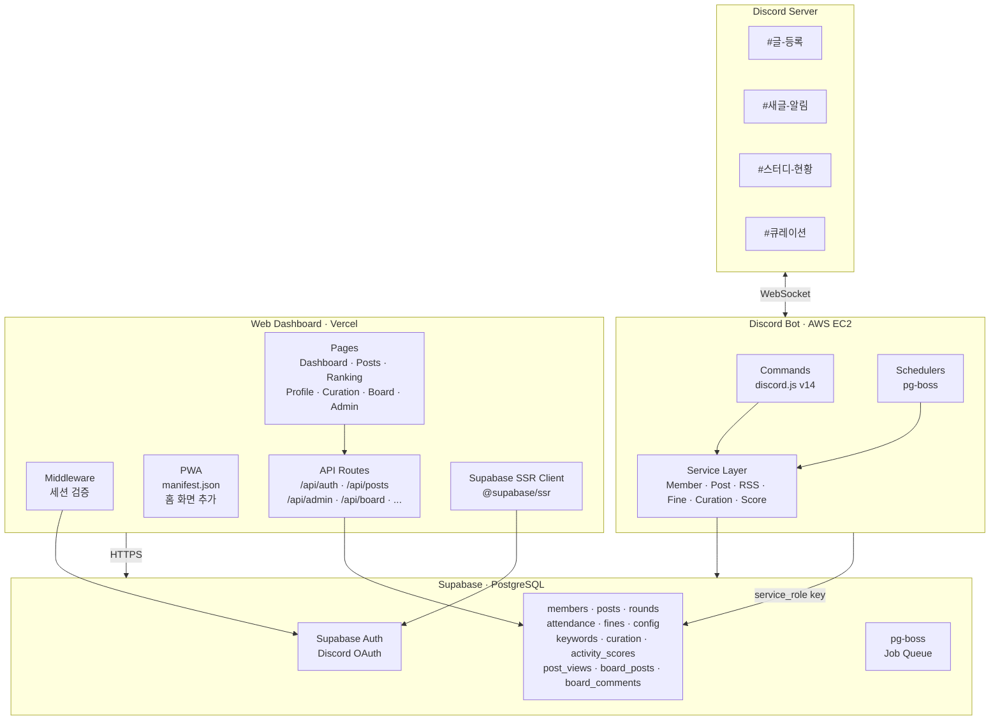
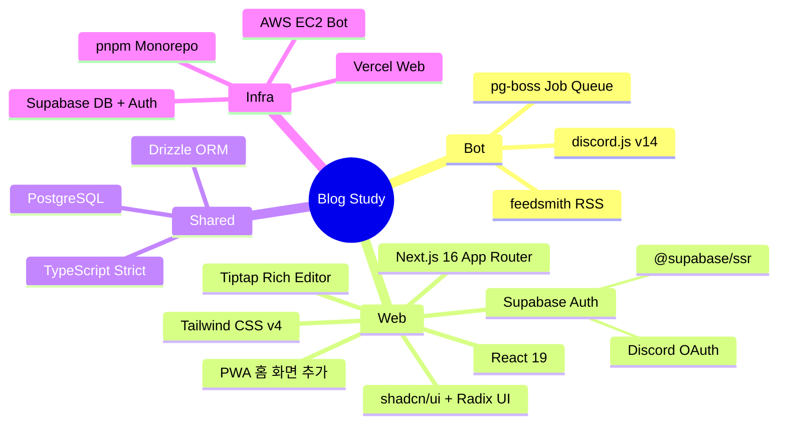
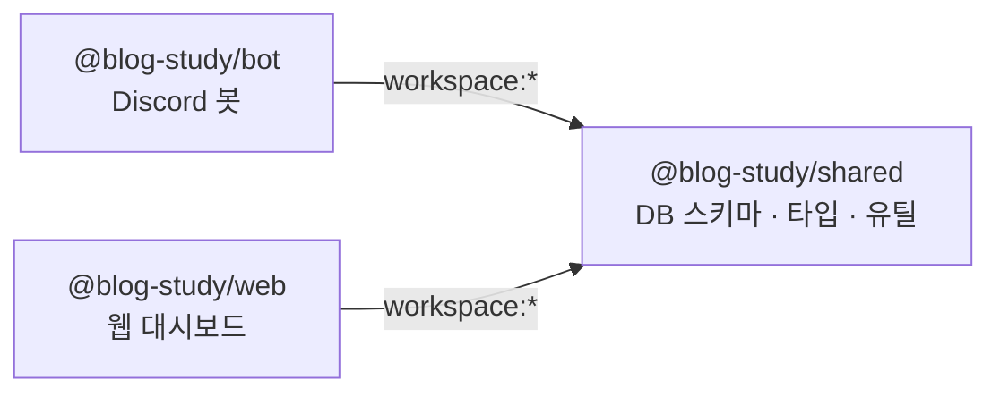
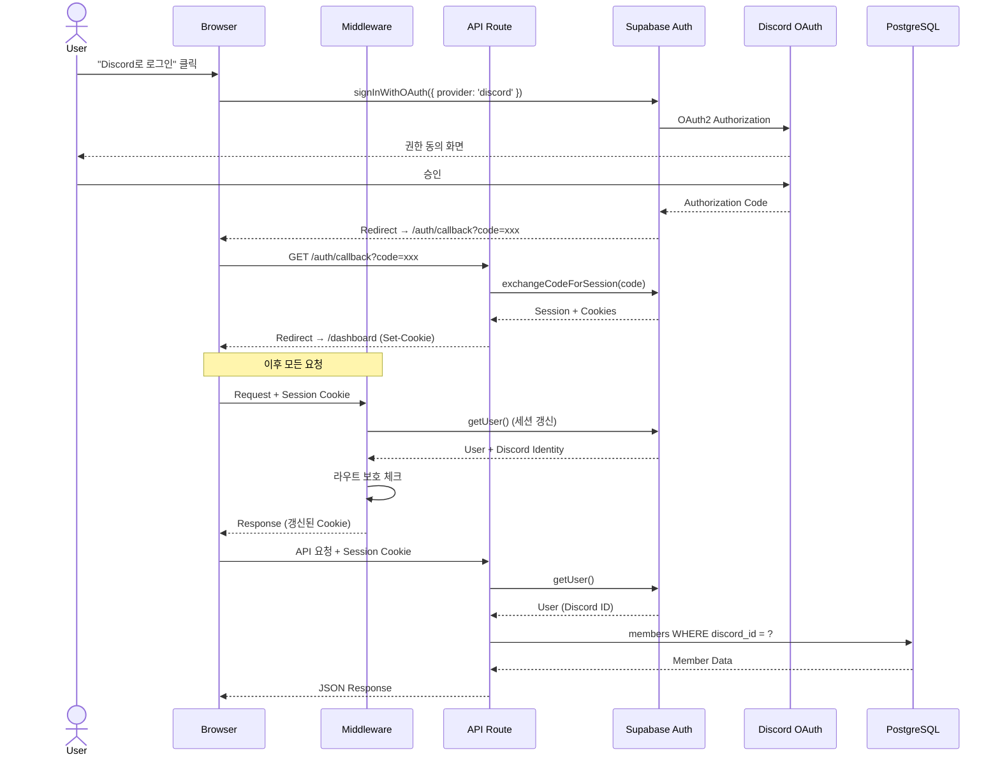
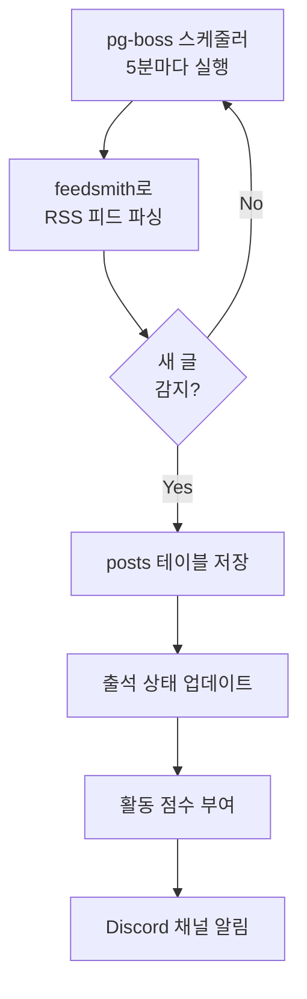
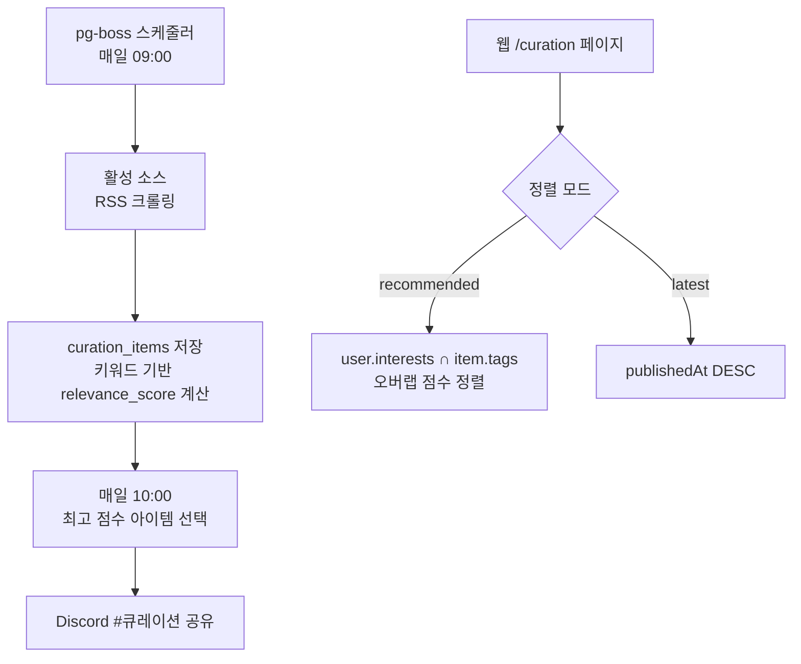
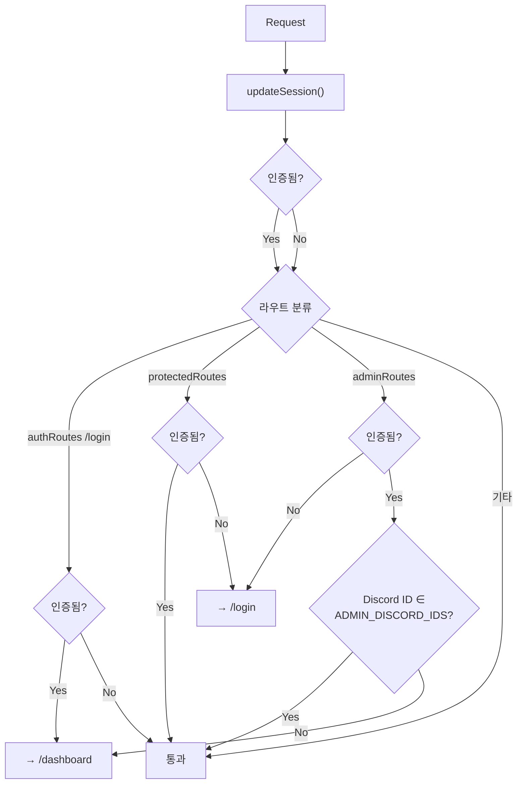
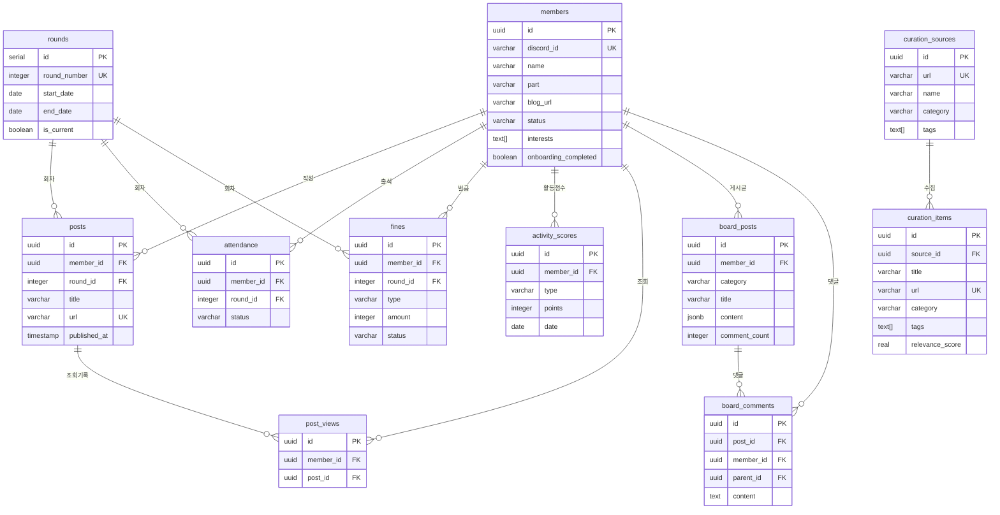
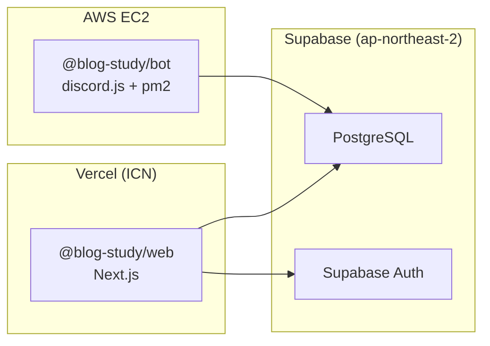

# Blog Study Admin - 시스템 아키텍처

> 최종 업데이트: 2026-03-06

블로그 글쓰기 스터디 운영 자동화 플랫폼. Discord 봇이 RSS 수집/출석/벌금/큐레이션을 자동화하고, 웹 대시보드로 멤버/관리자가 현황을 확인한다.

## 전체 구조

## 기술 스택

## 기술 스택 선정 이유

| 영역 | 선택 | 이유 |
|------|------|------|
| **Auth** | Supabase Auth (Discord OAuth) | Discord 기반 스터디이므로 OAuth 자연스러움. JWT/세션/이메일 인증 코드 전부 제거. 무료 50K MAU |
| **DB** | Supabase PostgreSQL + Drizzle ORM | Supabase 무료 티어로 DB+Auth+Realtime 통합. Drizzle은 타입 안전 + 가벼운 ORM |
| **Web** | Next.js App Router + shadcn/ui | App Router의 서버 컴포넌트/API Route 통합. shadcn/ui는 커스터마이징 자유도 최고 |
| **Bot** | discord.js v14 | 사실상 유일한 선택지. 안정적이고 문서 풍부 |
| **Job Queue** | pg-boss | PostgreSQL 기반으로 추가 인프라 불필요. 트랜잭션 보장, 재시도/동시성 관리 |
| **Monorepo** | pnpm workspace | 빠른 설치, 엄격한 의존성 관리. shared 패키지로 스키마/타입 공유 |

상세 결정 근거: [`docs/26-03-06-tech-decisions.md`](./26-03-06-tech-decisions.md)

## 패키지 구조

| 패키지 | 설명 | 배포 |
|--------|------|------|
| `packages/shared` | Drizzle 스키마, 타입, 유틸 | npm (workspace 내부) |
| `packages/bot` | Discord 봇, 스케줄러 | AWS EC2 |
| `packages/web` | Next.js 대시보드, API Routes | Vercel |

## 인증 아키텍처

### 인증 레이어 분리

| 컨텍스트 | 인증 방식 | Discord ID 추출 |
|----------|----------|-----------------|
| **웹 브라우저** | Supabase Auth (Discord OAuth PKCE) | `user.identities[].id` where `provider === 'discord'` |
| **웹 미들웨어** | `@supabase/ssr` 쿠키 기반 세션 | 동일 |
| **웹 API Route** | `createClient()` → `getUser()` | 동일 |
| **Discord 봇** | `service_role` key로 직접 DB 접근 | `interaction.user.id` (discord.js) |

## 데이터 흐름

### RSS 글 수집 → 알림

### 큐레이션 추천 흐름

## 라우트 구조

### 웹 페이지

| 그룹 | 경로 | 설명 | 보호 |
|------|------|------|------|
| Public | `/` | 랜딩 페이지 | - |
| Auth | `/login` | Discord OAuth 로그인 | 인증 시 /dashboard 리다이렉트 |
| User | `/dashboard` | 대시보드 | 로그인 필수 |
| User | `/posts` | 글 목록 | 로그인 필수 |
| User | `/ranking` | 랭킹 | 로그인 필수 |
| User | `/curation` | 큐레이션 | 로그인 필수 |
| User | `/board` | 커뮤니티 게시판 | 로그인 필수 |
| User | `/members` | 멤버 목록 | 로그인 필수 |
| User | `/members/[id]` | 멤버 상세 | 로그인 필수 |
| User | `/profile` | 프로필 | 로그인 필수 |
| Admin | `/admin` | 관리자 대시보드 | 관리자 전용 |
| Admin | `/admin/members` | 멤버 관리 | 관리자 전용 |
| Admin | `/admin/attendance` | 출석 관리 | 관리자 전용 |
| Admin | `/admin/fines` | 벌금 관리 | 관리자 전용 |
| Admin | `/admin/scores` | 점수 관리 | 관리자 전용 |
| Admin | `/admin/curation` | 큐레이션 소스 관리 | 관리자 전용 |
| Admin | `/admin/settings` | 설정 | 관리자 전용 |

### 미들웨어 보호 로직

## DB 스키마

### 테이블 관계

상세 스키마: [`docs/26-03-06-schema-summary.md`](./26-03-06-schema-summary.md)

## 레이아웃 구조

| 뷰포트 | 내비게이션 | 컴포넌트 |
|--------|-----------|---------|
| Desktop (md+) | 좌측 고정 사이드바 (접기/펼치기) | `Sidebar` |
| Mobile (<md) | 하단 고정 탭 바 (5개 메뉴) | `BottomNav` |

- **Header**: 로고 + 다크모드 토글 + 프로필 드롭다운 (관리자 링크 포함)
- **PWA**: `manifest.json` + 아이콘 (192/512) → 홈 화면 추가 지원, 서비스 워커 없음 (lightweight)

## 스케줄러 (pg-boss)

| 작업 | 주기 | 설명 |
|------|------|------|
| RSS Poller | 5분 | active 멤버 RSS 피드 수집 |
| Attendance Checker | 매주 화 00:00 | 지각/결석 판정 |
| Fine Reminder | 매일 10:00 | 미납 벌금 DM 리마인드 |
| Curation Crawler | 매일 09:00 | 외부 컨텐츠 크롤링 |
| Daily Content | 매일 10:00 | 큐레이션 컨텐츠 공유 |
| Round Reporter | 회차 종료 시 | 회차 리포트 자동 생성 |

## 배포 구조

| 서비스 | 월 비용 |
|--------|--------|
| AWS EC2 (Bot) | 기존 서버 활용 |
| Vercel (Web) | $0 (무료) |
| Supabase (DB + Auth) | $0 (무료) ~ $25 (Pro) |
| **합계** | **$0 ~ $25/월** |

## 핵심 의존성 버전

| 패키지 | 버전 | 비고 |
|--------|------|------|
| Node.js | 22 | Runtime |
| TypeScript | 5.x | Strict mode |
| Next.js | 16.1 | App Router |
| React | 19.2 | Server Components |
| Tailwind CSS | 4.2 | PostCSS 기반 |
| discord.js | 14.x | Bot framework |
| Drizzle ORM | 0.33 | Type-safe SQL |
| pg-boss | latest | Job queue |
| feedsmith | 2.9 | RSS parser |
| @supabase/ssr | 0.8 | Auth SSR |
| Tiptap | 3.20 | Rich text editor |
| shadcn/ui | latest | UI components |
